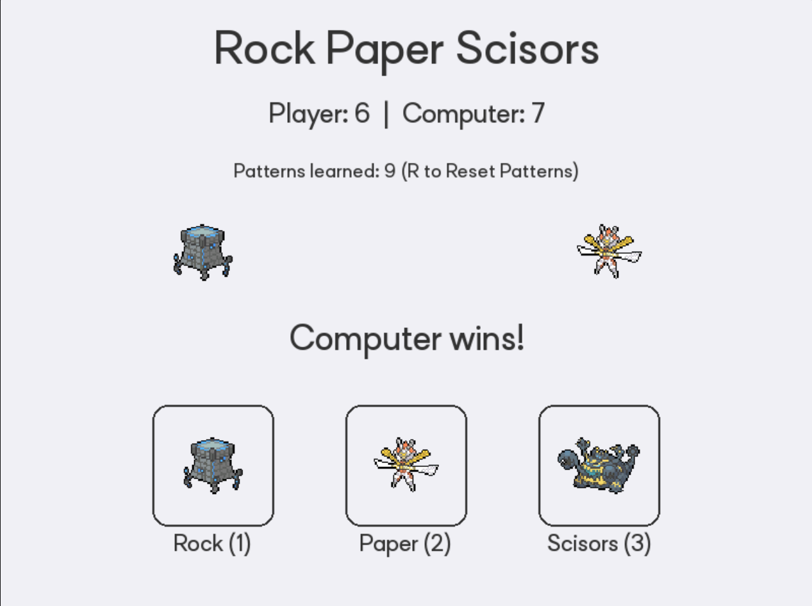

# Markov Janken 

This is a replica of [this old project of mine](https://github.com/zenze-sama/markov_janken), had to rewrite it in python because I wanted a web version and c++ is tough to compile to web (or I just suck).

A rock paper scissor (janken) game that tries to predict your moves.

This uses a Markov Chain to predict your next move based on your recent move history. In this particular case, the last two moved because humans dont tend to think farther in future than that.

For Example: If the player's last two moves were Rock and Paper, the algorithm checks how frequently the player chose Rock, Paper, or Scissors after the "RP" sequence. The AI then predicts the most likely next move and counters it (e.g., if the player usually follows "RP" with Scissors, then the AI plays Rock) and if no pattern exists yet, its random because why not!

Over time this "should" adapt to the players subconscious decisions and get a 100% win-rate. I am using "should" because humans are not dumb, we will obviously change our strategy and pay attention to our monitor if a program wins 5 times in a row.

## Play it: https://zenze-sama.github.io/markov-janken-pygame/

## Controls:

| Action         | Key / Mouse          |
|----------------|----------------------|
| Rock           | `1` or Click Rock    |
| Paper          | `2` or Click Paper   |
| Scissors       | `3` or Click Scissors|
| Reset Patterns | `R`                  |

will add a reset counter button (maybe)
